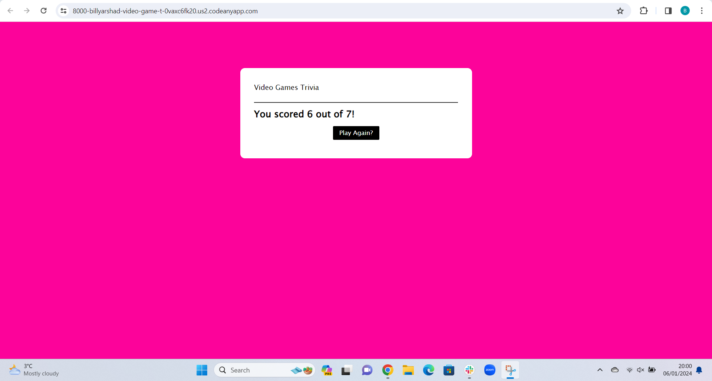

# **Site Title**

Video Game Trivia

## **Site Overview**

I've decided to create my trivia quiz called "Video Game" because Gaming is my passion and also my hobby since my childhood. 

## Table of contents

- [**Site Title**](#site-title)
  - [**Site Overview**](#site-overview)
  - [Table of contents](#table-of-contents)
  - [**Planning stage**](#planning-stage)
    - [**Target Audiences:**](#target-audiences)
    - [**User Stories:**](#user-stories)
    - [**Site Aims:**](#site-aims)
    - [**Color Scheme:**](#color-scheme)
  - [**Typography**](#typography)
  - [**Current Features Common to all pages**](#current-features-common-to-all-pages)
      - [\*features](#features)
  - [**Future-Enhancements**](#future-enhancements)
  - [**Testing Phase**](#testing-phase)
  - [**Bugs**](#bugs)
  - [**Deployment**](#deployment)
  - [**Tech**](#tech)
  - [**Credits**](#credits)
    - [**Honorable mentions**](#honorable-mentions)
    - [**Content:**](#content)

## **Planning stage**

### **Target Audiences:**

Users want to test their knowledges on gaming. 

### **User Stories:**

I want to see these buttons clearly.
I want to answer those interesting questions.
​

### **Site Aims:**

My website is aimed to encourage them to learn more about gaming.
​

### **Color Scheme:**

​
I have decided to choose colours for my trivia page design:
​
#FC039A
#fff
#000000
#333
#222
#00E66E
#E50101

All these colours were from Adobe Color. It's in "Content"

## **Typography**
​
I've decided to choose 'Lucida Sans', 'Lucida Sans Regular', 'Lucida Grande', 'Lucida Sans Unicode', Geneva, Verdana, sans-serif; in Codeanywhere, not Google Font because I feel like this font is my favourite.

## **Current Features Common to all pages**

#### *features
​
I have created 7 questions where users have to answer correctly. If they succeed to answer those questions, then they have an option to restart. There is the correct and incorrect answers per question. It will motivate them to answer these questions.

​

​

## **Future-Enhancements**

I would like to add new questions and also create the timer to encourage users to answer before it's too late.​

## **Testing Phase**

​
- Validators - I used three websites to test HTML, CSS and JS on my website.

Here are these results:-

​

## **Bugs**

​When I tested my trivia website, there was a bug that would show the "test" question feature, so I have managed to fix it by holding "CTRL" and click the refresh button at the same time to solve the bug. 

## **Deployment**

I deployed the page on GitHub pages via the following procedure: -
​

1. From my Video Game Trivia project [repository](https://github.com/BillyArshad/Video_Game_Trivia_PP2), go to the **Settings** tab.
2. From the left-hand menu, select the **Pages** tab.
3. Under the **Source** section, select the **Main** branch from the drop-down menu and click **Save**.
4. A message will be displayed to indicate a successful deployment to GitHub pages and provide the live link.
​
You can find the live site via the following URL - [live webpage](https://billyarshad.github.io/Video_Game_Trivia_PP2/)

***
​

## **Tech**

- HTML
- CSS
- Javascript
​

## **Credits**

### **Honorable mentions**

​
Richard Wells (My mentor) who helped me with my second project. 
​

### **Content:**

<https://color.adobe.com/create/color-wheel​> - Adobe Color
https://www.youtube.com/watch?v=PBcqGxrr9g8 - GreatStack for the quiz game with Javascript, but I have managed to tweak those codes a little with Richard Wells' help.
